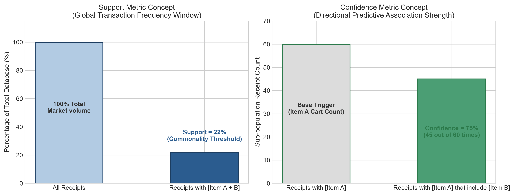
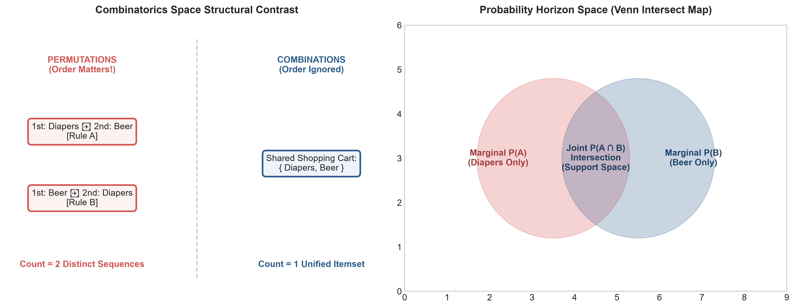
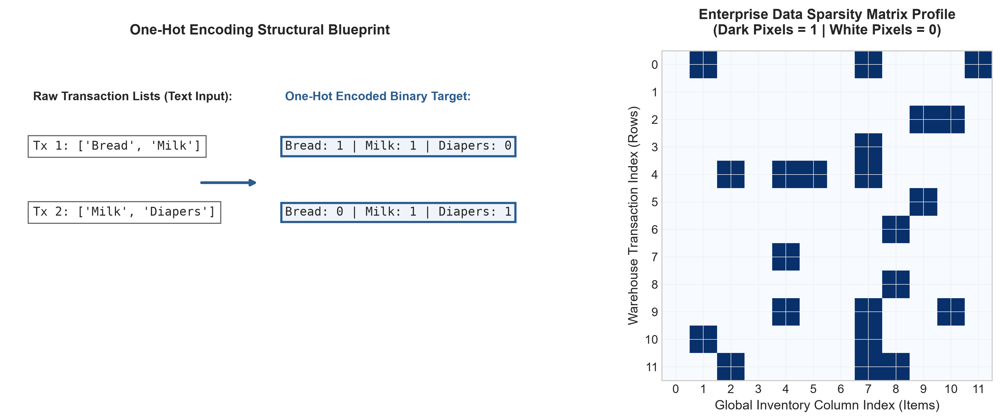
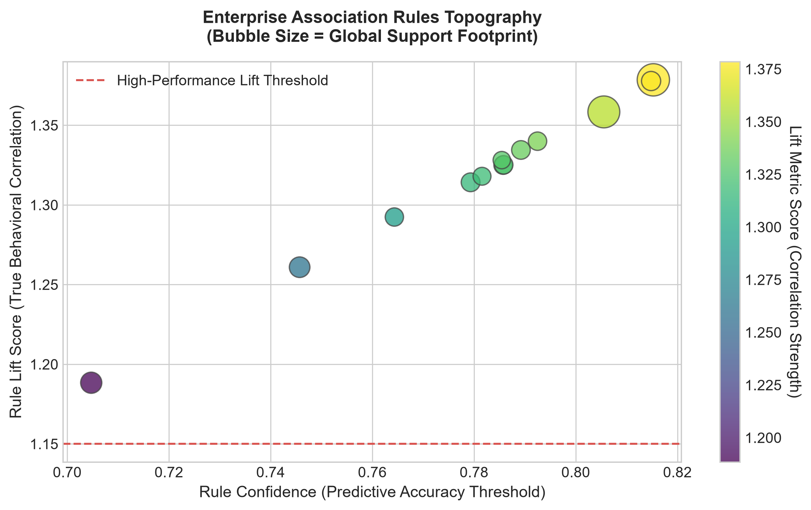

# 🛒 The Layman Guide to Unsupervised Learning & Association Rule Physics

Welcome to the plain-English blueprint breaking down how modern recommendation engines process raw transactional history without historical target labels.

---

## 📊 Concept 1: The Building Blocks of Association (Support vs. Confidence)

Unsupervised learning algorithms look for recurring human habits by mapping frequencies across a multi-dimensional matrix. We track these connections using two main metrics:

### 1. Support (The Global Footprint)
* **What it measures:** How common a combination of items is across your *entire* database.
* **The Math:** (Number of receipts containing Item A and Item B) divided by (Total receipts in the warehouse). If a rule has low support, it means the item combination is incredibly rare, making it less useful for broad marketing campaigns.

### 2. Confidence (The Directional Arrow)
* **What it measures:** The operational reliability of a prediction loop. Once a customer adds Item A to their cart, what is the exact mathematical probability that they will also grab Item B?
* **The Math:** (Number of receipts containing both items) divided by (Total receipts containing *just* Item A). This is a one-way street: the confidence of buying Beer when you have Diapers in your cart can be drastically different from the confidence of buying Diapers when you are purchasing Beer.

---

# 🎲 Mathematical Architecture: Combinatorics & Probability Foundations

To calculate unsupervised relationships or complex feature weights, machine learning systems must calculate how data groups itself, maps its space, and computes certainty boundaries.

---

## 🧮 Section 1: Combinatorics (Data Configurations)

### 1. Permutations
* **What it is:** The mathematical calculation of all possible ways to arrange a specific subset of items where **the order of arrangement matters completely**.
* **What it does in ML:** It calculates directional sequences. In market basket analysis, a permutation treats the sequence `[Diapers ➔ Beer]` as a completely different structural rule than `[Beer ➔ Diapers]`. In Natural Language Processing (NLP), permutations define sentence structures: "Data loves science" contains identical words to "Science loves data", but the permutation shifts the semantic matrix.
* **The Mathematical Formula:** 
  \[P(n, k) = \frac{n!}{(n-k)!}\]

### 2. Combinations
* **What it is:** The mathematical calculation of unique groupings or subsets created from a larger pool where **the order of items is completely ignored**.
* **What it does in ML:** It controls feature search space reduction. When our Apriori engine calculates an itemset like `{Bread, Milk, Butter}`, a combination treats it as a single, static object regardless of how the items are arranged in the shopping cart. This prevents algorithms from wasting computational cycles on identical item configurations.
* **The Mathematical Formula:** 
  \[C(n, k) = \binom{n}{k} = \frac{n!}{k!(n-k)!}\]

### 3. Factorial (\(n!\))
* **What it is:** The product of all positive integers less than or equal to a target integer \(n\).
* **What it does in ML:** It defines the computational upper bound of combinatorial explosions. If an e-commerce catalog contains 10 products, the total number of ways to arrange them is \(10!\) (\(3,628,800\)). Factorials warn data engineers when an unsupervised network is about to run out of RAM, forcing the use of prune limits like support gates.

---

## 🎲 Section 2: Probability Theory (Certainty Horizons)

### 1. Joint Probability (\(P(A \cap B)\))
* **What it is:** The probability of two or more independent or dependent events **occurring simultaneously** in a shared sample window.
* **What it does in ML:** It calculates the raw frequency of co-occurrence. In recommendation engines, this is the exact mathematical baseline for **Support**—measuring how frequently Item A and Item B land in the exact same transaction row across the entire database layout.
* **The Mathematical Formula:** 
  \[P(A \cap B) = P(A) \times P(B\vert{}A)\]

### 2. Marginal Probability (\(P(A)\))
* **What it is:** The probability of a single isolated event occurring, completely **independent of any other variables** or conditions in the ecosystem.
* **What it does in ML:** It establishes baseline thresholds. Before checking if a user will buy a product based on their history, a model must understand the global popularity of that product. If a product has a marginal probability of 0.001%, it represents an extreme outlier condition.

### 3. Conditional Probability (\(P(B\vert{}A)\))
* **What it is:** The probability of an event \(B\) occurring, given the absolute mathematical certainty that **another event \(A\) has already occurred**.
* **What it does in ML:** It drives target forecasting vectors. In classification projects, it defines output confidence thresholds: \(P(\text{Churn}=1 \mid \text{Calls}=5)\). In our current recommendation workspace, this is the exact operational framework behind **Confidence**—calculating the likelihood a user selects Item B once Item A is actively sitting inside their shopping cart.
* **The Mathematical Formula:** 
  \[P(B\vert{}A) = \frac{P(A \cap B)}{P(A)}\]

---

# 🎲 Mathematical Architecture: Combinatorics & Probability Foundations

To calculate unsupervised relationships or complex feature weights, machine learning systems must calculate how data groups itself, maps its space, and computes certainty boundaries.

---

## 🧮 Section 1: Combinatorics (Data Configurations)

### 1. Factorial (\(n!\))
* **Definition:** The product of all positive integers less than or equal to a target integer \(n\).
* **Function in ML:** It defines the computational upper bound of combinatorial explosions. If an e-commerce catalog contains 10 products, the total number of ways to arrange them is \(10!\) (\(3,628,800\)). Factorials warn data engineers when an unsupervised network is about to run out of RAM, forcing the use of prune limits like support gates.

### 2. Combinations
* **Definition:** The mathematical calculation of unique groupings created from a larger pool where **the internal order of items is completely ignored**.
* **Function in ML:** It controls feature search space reduction. When our Apriori engine calculates an itemset like `{Bread, Milk, Butter}`, a combination treats it as a single, static object regardless of how the items are arranged in the shopping cart. This prevents algorithms from wasting computational cycles on identical item configurations.

### 3. Permutations
* **Definition:** The mathematical calculation of all possible ways to arrange a specific subset of items where **the order of arrangement matters completely**.
* **Function in ML:** It calculates directional sequences. In market basket analysis, a permutation treats the sequence `[Diapers ➔ Beer]` as a completely different structural rule than `[Beer ➔ Diapers]`, capturing true directional purchasing behaviors.

---

## 🎲 Section 2: Probability Theory (Certainty Horizons)

### 1. Marginal Probability (\(P(A)\))
* **Definition:** The probability of a single isolated event occurring, completely **independent of any other variables** or conditions in the ecosystem.
* **Function in ML:** It establishes baseline thresholds. Before checking if a user will buy a product based on their history, a model must understand the global popularity of that product.

### 2. Joint Probability (\(P(A \cap B)\))
* **Definition:** The probability of two or more independent or dependent events **occurring simultaneously** in a shared sample window.
* **Function in ML:** It calculates the raw frequency of co-occurrence. In recommendation engines, this is the exact mathematical baseline for **Support**—measuring how frequently Item A and Item B land in the exact same transaction row across the database layout.

### 3. Conditional Probability (\(P(B\vert{}A)\))
* **Definition:** The probability of an event \(B\) occurring, given the absolute mathematical certainty that **another event \(A\) has already occurred**.
* **Function in ML:** It drives target forecasting vectors. In our current recommendation workspace, this is the exact operational framework behind **Confidence**—calculating the likelihood a user selects Item B once Item A is actively sitting inside their shopping cart.

---

# 🏗️ Computational Architecture: Structural Transformation & Sparsity Barriers

Before mathematical algorithms can extract structural behavior paths across transactional text ledgers, the data coordinates must be reformatted into a rigid numerical grid.

---

## 🗺️ Section 3: Feature Space Digital Realignment

### 1. One-Hot Encoding (Binary Matrix Profiling)
* **Definition:** The process of converting unstructured, variable-length text records or item groups into a fixed-width row vector of boolean flags (`1` or `0`) mapped against a static global vocabulary array.
* **Function in ML:** It establishes data conformity. It translates categorical items like `"Bread"` or `"Beer"` into clear spatial vectors, allowing optimization solvers and rule engines to compute frequency intersection metrics using highly parallelized linear algebra operations.

### 2. The Matrix Sparsity Barrier
* **Definition:** A structural condition where the number of empty elements or zero values in a data frame significantly outweighs the volume of active, populated records.
* **Function in ML:** It serves as a critical performance warning threshold. In massive e-commerce architectures stocking hundreds of thousands of retail products, individual receipt rows will register as over 99.9% sparse. If unmanaged, this introduces massive memory leaks by forcing the CPU to read and hold billions of useless zero-bits in RAM.

---

# 🎯 Operational Evaluation Architecture: Advanced Association Metrics

To convert raw uncovered item correlations into actionable corporate layout and digital checkout recommendation strategies, engines audit rules across confidence, lift, and conviction fields.

---

## 📉 Section 4: Validation Metrics

### 1. Lift (True Correlation Multiplier)
* **Definition:** The ratio measuring the actual co-occurrence rate of two distinct item combinations against the probability of their completely independent, random distribution.
* **Function in ML:** It removes baseline popularity bias. It ensures that a high confidence score represents a genuine human cross-purchasing habit rather than an artifact of a product simply being highly popular globally.

### 2. Conviction (Asymmetric Rule Stability Ledger)
* **Definition:** The mathematical evaluation measuring the directional dependency strength of an extracted rule by mapping the expected frequency of incorrect forecasts.
* **Function in ML:** It validates directional rule stability, verifying that the predictive correlation moves in a stable, predictable vector from antecedent to consequent.
